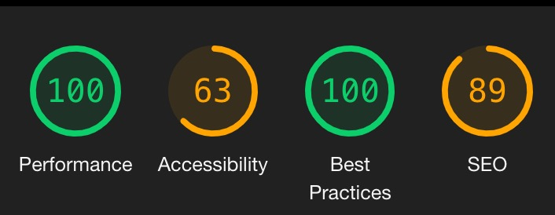

# Cyphemes work - siyin

## Accessibility Fault😢
- Less contrast ratio .
- Disabling mobile zooming .
## Features⭐️

- ### Declarative Rendering

  `Vue.js`
- ### Desktop/mobile device adaptation
  
  Media query bind layout styleSheet.

- ### Switch theme

  - Use `<link disable>` to switch theme styleSheet,common styles are already import.
  - Switch button debounce.
  - Storage theme setting into `LocalStorage`.
- ### Daggable

  - Ues `vuedraggable.js` and storage order into `LocalStorage`.

  - [SortableJS
/
Vue.Draggable](https://github.com/SortableJS/Vue.Draggable)

  - 🤔I choose to keeps daggable in mobile device, but it was a little bit effected scroll.

- ### Animation
  - Decrease number bouncing
  - Mouse hover block animation（disable in mobile）
  - Switch animation

### 😢always forgot commit......